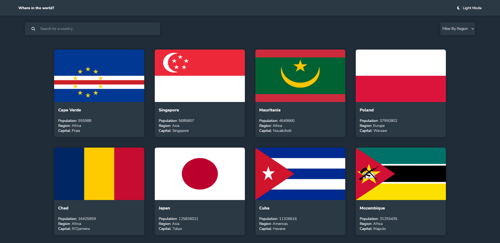
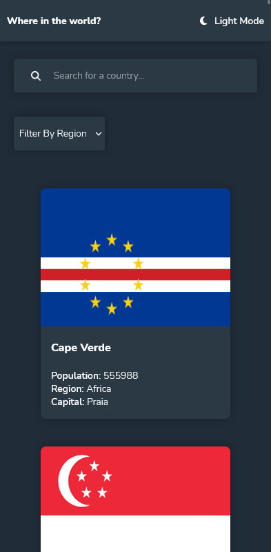

# Frontend Mentor - REST Countries API with color theme switcher solution

This is a solution to the [REST Countries API with color theme switcher challenge on Frontend Mentor](https://www.frontendmentor.io/challenges/rest-countries-api-with-color-theme-switcher-5cacc469fec04111f7b848ca). Frontend Mentor challenges help you improve your coding skills by building realistic projects.

## Table of contents

- [Overview](#overview)
  - [The challenge](#the-challenge)
  - [Screenshot](#screenshot)
  - [Links](#links)
- [My process](#my-process)
  - [Built with](#built-with)
  - [What I learned](#what-i-learned)
- [Author](#author)

## Overview

### The challenge

Users should be able to:

- [x] See all countries from the API on the homepage
- [x] Search for a country using an `input` field
- [x] Filter countries by region
- [ ] Click on a country to see more detailed information on a separate page
- [ ] Click through to the border countries on the detail page
- [x] Toggle the color scheme between light and dark mode _(optional)_

### Screenshot



<p align="center">
    
</p>

### Links

- Live Site URL: [Add live site URL here]()

## My process

### Built with

- Flexbox
- Mobile-first workflow
- [React](https://reactjs.org/) - JS library
- [Styled Components](https://styled-components.com/) - For styles

### What I learned

Using typescript, React.FC types requires you to specify which props that components expect using a type or interface.

In this example, the Card component receives multiple props.

```html
<Card
  key="{idx}"
  flag="{country.flags.png}"
  population="{country.population}"
  region="{country.region}"
  capital="{country.capital}"
  name="{country.name.common}"
/>
```

In the Card component tsx file, we specify the Props that the component expects to receive.

```typescript
interface Props {
  flag: string;
  population: number;
  name: string;
  region: string;
  capital: string;
}
```

Then, we can access these props on the component this way.

```typescript
const Card: React.FC<Props> = ({ flag, population, name, region, capital }) => {};
```

## Author

- Frontend Mentor - [@yan-batista-1326](https://www.frontendmentor.io/profile/yan-batista-1326)
- LinkedIn - [@YanBatista](https://www.linkedin.com/in/yanbatista/)
