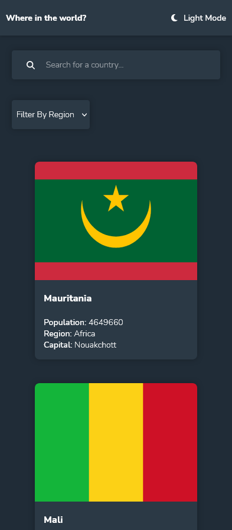

# Frontend Mentor - REST Countries API with color theme switcher solution

This is a solution to the [REST Countries API with color theme switcher challenge on Frontend Mentor](https://www.frontendmentor.io/challenges/rest-countries-api-with-color-theme-switcher-5cacc469fec04111f7b848ca). Frontend Mentor challenges help you improve your coding skills by building realistic projects.

## Table of contents

- [Overview](#overview)
  - [The challenge](#the-challenge)
  - [Screenshot](#screenshot)
  - [Links](#links)
- [My process](#my-process)
  - [Built with](#built-with)
  - [What I learned](#what-i-learned)
- [Author](#author)

## Overview

### The challenge

Users should be able to:

- [x] See all countries from the API on the homepage
- [x] Search for a country using an `input` field
- [x] Filter countries by region
- [x] Click on a country to see more detailed information on a separate page
- [x] Click through to the border countries on the detail page
- [x] Toggle the color scheme between light and dark mode _(optional)_

### Screenshot


<p align="center">
    
    
</p>

### Links

- Live Site URL: [Vercel](https://country-flags-beta.vercel.app)

## My process

### Built with

- Flexbox
- Mobile-first workflow
- TypeScript
- [React](https://reactjs.org/) - JS library
- [Styled Components](https://styled-components.com/) - For styles

### What I learned

---

**React Typescript Components**

Using typescript, React.FC types requires you to specify which props that components expect using a type or interface.

In this example, the Card component receives multiple props.

```html
<Card
  key="{idx}"
  flag="{country.flags.png}"
  population="{country.population}"
  region="{country.region}"
  capital="{country.capital}"
  name="{country.name.common}"
/>
```

In the Card component tsx file, we specify the Props that the component expects to receive.

```typescript
interface Props {
  flag: string;
  population: number;
  name: string;
  region: string;
  capital: string;
}
```

Then, we can access these props on the component this way.

```typescript
const Card: React.FC<Props> = ({ flag, population, name, region, capital }) => {};
```

---

**Styled Components Theme Provider**

We can create a .ts file with all the colors from a specific theme we want to use. The following code is an example of the dark theme used for this application.

```typescript
export default {
  title: "dark",
  colors: {
    text: "hsl(0, 0%, 100%)",
    input: "hsl(209, 23%, 22%)",
    background: "hsl(207, 26%, 17%)",
    elements: "hsl(209, 23%, 22%)",
  },
};
```

By putting the ThemeProvider around the App and passing it a theme file like the previous one, the application has access to the data of that file.

```typescript
import { ThemeProvider } from "styled-components";

function App() {
  return() {
    <ThemeProvider theme={theme}>
      ...
    </ThemeProvider>
  }
}
```

Data from theses files can be accessed using `${(props) => props.theme}` inside of style files, for example here in the `global.ts` file

```typescript
import { createGlobalStyle } from "styled-components";

export default createGlobalStyle`
    .btn {
        background-color: ${(props) => props.theme.colors.elements};
    }
`;
```

The `.btn` class is using the "elements" color from the theme file in the `ThemeProvider`.

If it's outiside of the `styled`, theme data can be access through context. Here's an example from the Header `index.tsx`

```typescript
import React, { useContext } from "react";
import { ThemeContext } from "styled-components";

const Header: React.FC<Props> = ({ toggleTheme }) => {
  const { title } = useContext(ThemeContext);
};
```

We use the `ThemeContext` from the styled-component as parameter for the `useContext` Hook from React to access the data. In this case, I'm destructuring and accessing only the title of the theme so I know if it's either light or dark.

If we use 2 different themes, we can simply change the file in the `<ThemeProvider theme={}>` and all colors will change, considering that all themes should have all the same structure. A `styled.d.ts` should be created to inform the structure of the theme.

```typescript
import "styled-components";

declare module "styled-components" {
  export interface DefaultTheme {
    title: string;
    colors: {
      text: string;
      input: string;
      background: string;
      elements: string;
    };
  }
}
```

## Author

- Frontend Mentor - [@yan-batista-1326](https://www.frontendmentor.io/profile/yan-batista-1326)
- LinkedIn - [@YanBatista](https://www.linkedin.com/in/yanbatista/)
